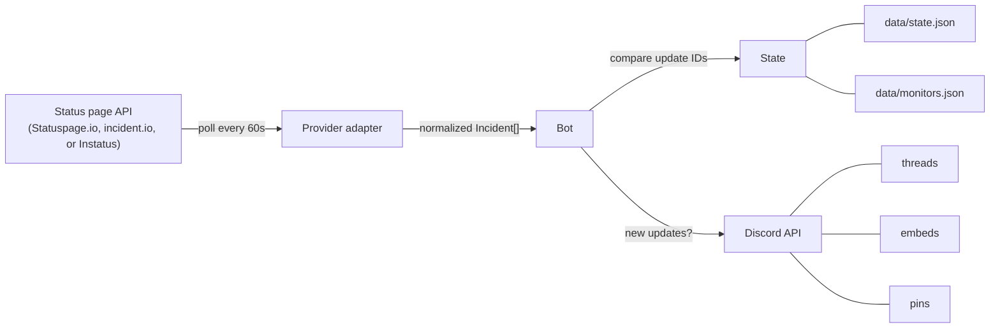

# Architecture

## Overview

squawk is a Bun/TypeScript application with bot logic in `src/index.ts` (~2100 lines, single file by design) and provider-specific API adapters in `src/providers/` (one small file per provider). It connects to Discord via [discord.js](https://discord.js.org/) and polls supported public status page APIs on a timer.

## Data Flow

1. Every `POLL_INTERVAL_MS` (default 60s), the bot calls `getProvider(monitor).fetchIncidents()` for each monitor. The provider adapter handles its API quirks and returns a normalized `Incident[]`.
2. Compares returned update IDs against `monitorState.postedUpdateIds`
3. For each unseen update: ensures a thread exists, posts the update embed, syncs the parent message
4. Reconciles `openIncidentIds` against the API to detect vanished incidents
5. Persists updated state to `data/state.json`

## Module Structure

The single source file is organized into these logical sections, in file order. Each is identified by the symbol it starts at rather than a line number, so the table stays accurate as the file grows — jump to a section by searching for its anchor.

| Section | Starts at | Purpose |
|---------|-----------|---------|
| Imports & Validation | `booleanFromEnv` | Zod schemas, env parsing, `loadMonitors()` |
| Runtime Monitors | `withMonitorLock` | Serialized read/modify/write of `data/monitors.json` |
| Icon Resolution | `extractIconFromHtml` | Favicon scraping and the in-memory `monitorIcons` cache |
| State Types | `type MonitorState` | State-only types (canonical Incident/Summary types live in `src/providers/types.ts`) |
| Command Builders | `buildCommands` | Slash command definitions (dynamic via feature flags) |
| State I/O | `ensureStateFile` | Read/write `state.json` with migration support |
| Provider Dispatch | `fetchSummary` | Thin wrappers that dispatch to `getProvider(monitor)` from `src/providers/` |
| UI Rendering | `formatTimestamp` | Color/label maps and embed builders for status, incidents, updates, ghosts |
| Replay Logic | `byNewestUpdate` | Incident timeline replay and deduplication |
| Autocomplete | `handleAutocomplete` | Monitor autocomplete for slash commands |
| Command Registration | `registerCommands` | Discord REST API command push |
| Target Resolution | `getTargetChannel` | Monitor/channel resolution and access checks for commands |
| Pin Notice Tracking | `trackAndPrunePinNotice` | Prunes Discord's "pinned a message" system notices |
| Thread Management | `ensureIncidentThread` | Thread creation, parent sync, self-healing |
| Missing Incident Handler | `handleMissingIncidents` | Ghost detection and strikethrough rendering |
| Polling Core | `postLatestUpdatesForMonitor` | Main poll loop with open incident tracking |
| Command Handlers | `handleCleanupCommand`, `handleStatusCommand` | /cleanup, /status, /replay, /testpost, /clean, /monitor |
| Presence Rotation | `startPresenceRotation` | Rotating Discord activity |
| Concurrency Guard | `singleFlight` | Prevents overlapping poll cycles |
| Main Entry | `main` | Client setup, event handlers, login |

## Presence Rotation

The bot displays a rotating Discord presence that cycles every 15 seconds through three activities:

1. **Watching N status pages** — total monitor count (`No status pages` when zero)
2. **Watching N active incidents** — open incidents across all monitors (`No active incidents` when zero)
3. **Playing vX.Y.Z (Uptime: …)** — version from the `APP_VERSION` env var (auto-set in Docker builds) or `package.json`, plus uptime since the process started

Uptime is formatted at the coarsest useful granularity: `Xd Xh` past a day, `Xh Xm` past an hour, otherwise `Xm`.

The rotation reads state from disk each tick to get current incident counts, and reads `monitors.length` directly for the monitor count. A failed read logs and skips the tick rather than throwing.

## Key Design Decisions

### Single File (with a provider sidecar)
Bot logic lives in one file (`src/index.ts`) for simplicity — the project is small enough that splitting core logic into modules would add overhead without meaningful benefit. Provider-specific API code is the one exception: each provider lives in its own small file under `src/providers/` so adding a new provider is a drop-in change with no edits to `src/index.ts` beyond registering the provider.

### Polling Over Webhooks
The supported providers offer webhooks, but polling is simpler to deploy (no public endpoint needed) and works behind NATs/firewalls. The trade-off is a ~60s update delay.

### Thread-Per-Incident
Each incident gets its own Discord thread hanging off a "parent" embed in the channel. This keeps the main channel clean while preserving full timelines.

### Server-Side Open Incident Tracking
The bot maintains an `openIncidentIds` array in state to reliably detect when incidents vanish from the API. This prevents false ghosting of incidents the bot never saw as "open".

### Single-Flight Polling
The poll loop runs through a `singleFlight` guard so it never overlaps with itself. A cycle can outrun `POLL_INTERVAL_MS` when monitors are slow (failing APIs retry with backoff) or an incident triggers chatty Discord thread creation; without the guard, the overrunning cycle and the next `setInterval` tick would run concurrently, both observe a brand-new incident with no thread mapping, and each create a parent message + thread — producing duplicate threads (only one survives the last-writer-wins `writeState`). While a run is in flight, later ticks coalesce into it; the next fresh run starts after it settles.

### Self-Healing State
When Discord messages or threads are manually deleted, the bot detects missing resources (via DiscordAPIError codes 10003, 10008, 50001) and cleans up its state rather than crashing.

## Dependencies

| Package | Purpose |
|---------|---------|
| `discord.js` | Discord gateway + REST API |
| `zod` | Runtime validation for env vars and API payloads |

Dev-only: `typescript`, `@types/bun`.

## Error Handling Strategy

- **Zod validation** at startup catches misconfigured environment variables immediately
- **API errors** are caught per-monitor so one failing page doesn't block others
- **Discord API errors** with known codes (Unknown Channel, Unknown Message, Missing Access) trigger state cleanup instead of crashes
- **Transient errors** (network timeouts) are logged and retried on the next poll cycle
- **Interaction errors** are sent as ephemeral replies to the user
