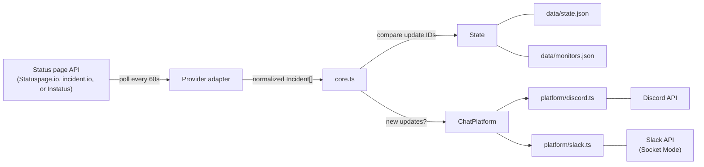

# Architecture

## Overview

squawk is a Bun/TypeScript application that polls supported public status page APIs on a timer and posts incidents to a chat platform. It is split three ways: **status page providers** (`src/providers/`), a **platform-neutral core** (`src/core.ts` and friends), and **chat platform adapters** (`src/platform/`). One deployment drives one chat platform, chosen at startup from `PLATFORM`.

## Data Flow

1. Every `POLL_INTERVAL_MS` (default 60s), the bot calls `getProvider(monitor).fetchIncidents()` for each monitor. The provider adapter handles its API quirks and returns a normalized `Incident[]`.
2. Compares returned update IDs against `monitorState.postedUpdateIds`
3. For each unseen update: ensures a thread exists, posts the update embed, syncs the parent message — all through the `ChatPlatform` interface, so the same code path drives Discord or Slack
4. Reconciles `openIncidentIds` against the API to detect vanished incidents
5. Persists updated state to `data/state.json`

## Module Structure

| File | Purpose |
|------|---------|
| `src/index.ts` | Entry point: resolves the platform, loads monitors, starts the poll loop |
| `src/config.ts` | Zod env schema, monitor schema, platform resolution, runtime monitor persistence |
| `src/state.ts` | `data/state.json` read/write with legacy migration |
| `src/icons.ts` | Favicon discovery and caching for embed author icons |
| `src/render.ts` | Platform-neutral `Embed` builders + the `TextFormat` markup interface |
| `src/core.ts` | Incident lifecycle, polling, and every command handler |
| `src/platform/types.ts` | The `ChatPlatform` seam: messages, threads, pins, commands, capabilities |
| `src/platform/discord.ts` | discord.js adapter |
| `src/platform/slack.ts` | Slack adapter (Socket Mode + Block Kit) |
| `src/providers/` | Per-provider status page API adapters |

Nothing outside `src/platform/` imports `discord.js` or `@slack/*`, and `src/core.ts` contains no platform-specific branching beyond capability checks.

### The ChatPlatform Seam

Adding a platform means implementing `ChatPlatform` and nothing else. Two conventions keep platform quirks out of the core:

- **`null` means "gone".** Any lookup returning `null` tells the core the resource is missing in a way that warrants pruning state. Discord's `10003`/`10008`/`50001`/`50013`/`50035` and Slack's `channel_not_found`/`message_not_found` are translated inside their adapters; every other failure throws and is handled upstream.
- **Capabilities gate optional work.** `threadArchive`, `pinNotices`, `deletableThreads`, `presence`, `autocomplete`, and `maxMessageDeleteAgeMs` describe what a platform can do. Slack turns off the first five, and the core simply skips that work rather than branching on platform identity.

### Rendering

`render.ts` produces a structural `Embed` (color, author, title, description, fields, footer) plus inline markup built through a `TextFormat` the adapter supplies. Discord's implementation emits Discord markdown and `<t:…>` timestamps; Slack's emits mrkdwn and `<!date^…>` timestamps. Status page text is passed through `fmt.escape()` so Slack's reserved `&`, `<`, `>` render literally, while markup Squawk generates itself is left alone.

Adapters then map the `Embed` to their native form: a discord.js `EmbedBuilder`, or a Slack attachment whose `color` supplies the accent bar and whose Block Kit blocks carry the content (inline fields become two-column field sections, full-width fields get their own).

## Presence Rotation

Discord only — Slack has no bot presence, so the rotation is skipped there via the `presence` capability.

The bot displays a rotating Discord presence that cycles every 15 seconds through three activities:

1. **Watching N status pages** — total monitor count (`No status pages` when zero)
2. **Watching N active incidents** — open incidents across all monitors (`No active incidents` when zero)
3. **Playing vX.Y.Z (Uptime: …)** — version from the `APP_VERSION` env var (auto-set in Docker builds) or `package.json`, plus uptime since the process started

Uptime is formatted at the coarsest useful granularity: `Xd Xh` past a day, `Xh Xm` past an hour, otherwise `Xm`.

The rotation reads state from disk each tick to get current incident counts, and reads `monitors.length` directly for the monitor count. A failed read logs and skips the tick rather than throwing.

## Key Design Decisions

### One Platform Per Deployment
State keys are opaque platform handles — Discord snowflakes or Slack `ts` values — so a single `data/state.json` belongs to one platform. Running both means running two instances with separate data volumes. This keeps the state format, the monitor schema, and the command surface identical across platforms instead of qualifying every ID by platform.

### Adapters, Not Branches
Both the status page side and the chat side sit behind small interfaces (`Provider`, `ChatPlatform`). The lifecycle in `core.ts` is written once against both. Adding a status page vendor or a chat platform is a new file plus a registration, not edits threaded through the lifecycle.

### Polling Over Webhooks
The supported providers offer webhooks, but polling is simpler to deploy (no public endpoint needed) and works behind NATs/firewalls. The trade-off is a ~60s update delay. Slack is driven over Socket Mode for the same reason — it needs no inbound HTTP.

### Thread-Per-Incident
Each incident gets its own thread hanging off a "parent" embed in the channel — a real thread channel on Discord, replies on the parent message on Slack. This keeps the main channel clean while preserving full timelines.

### Server-Side Open Incident Tracking
The bot maintains an `openIncidentIds` array in state to reliably detect when incidents vanish from the API. This prevents false ghosting of incidents the bot never saw as "open".

### Single-Flight Polling
The poll loop runs through a `singleFlight` guard so it never overlaps with itself. A cycle can outrun `POLL_INTERVAL_MS` when monitors are slow (failing APIs retry with backoff) or an incident triggers chatty Discord thread creation; without the guard, the overrunning cycle and the next `setInterval` tick would run concurrently, both observe a brand-new incident with no thread mapping, and each create a parent message + thread — producing duplicate threads (only one survives the last-writer-wins `writeState`). While a run is in flight, later ticks coalesce into it; the next fresh run starts after it settles.

### Self-Healing State
When messages or threads are manually deleted, the adapter reports them as `null` and the core cleans up its state rather than crashing.

## Dependencies

| Package | Purpose |
|---------|---------|
| `discord.js` | Discord gateway + REST API |
| `@slack/web-api` | Slack Web API client |
| `@slack/socket-mode` | Slack Socket Mode connection (no public endpoint required) |
| `zod` | Runtime validation for env vars and API payloads |

Only the active platform's client is loaded — `src/index.ts` imports the adapter dynamically after resolving `PLATFORM`.

Dev-only: `typescript`, `@types/bun`.

## Error Handling Strategy

- **Zod validation** at startup catches misconfigured environment variables immediately
- **API errors** are caught per-monitor so one failing page doesn't block others
- **Chat platform errors** meaning "this resource is gone" are translated to `null` by the adapter and trigger state cleanup instead of crashes
- **Transient errors** (network timeouts) are logged and retried on the next poll cycle
- **Interaction errors** are sent as ephemeral replies to the user
