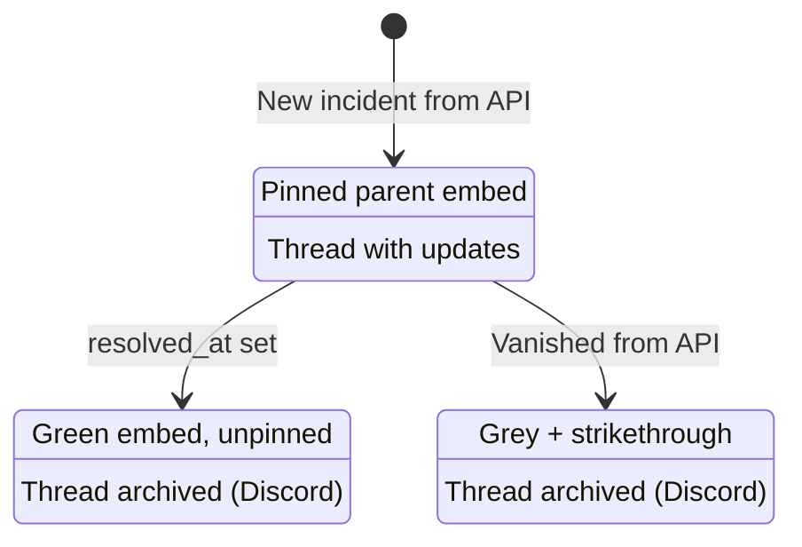

# Incident Lifecycle

This page describes how incidents move through their lifecycle from the bot's perspective. The flow is identical on Discord and Slack, with one exception: Slack threads have no archived state, so the archive steps below are Discord-only.

## States

### Active

- **Trigger:** A new incident appears in the status page API with no `resolved_at` timestamp
- **Actions:**
  - Parent embed posted in the monitor channel (color-coded by impact)
  - Parent message pinned. On Discord the bot tracks the ID of the "pinned a message to this channel" system notice in `monitorState.lastPinNoticeMessageId` and deletes the previous one on each new pin, so the channel surfaces just one marker no matter how many incidents have come through. (First run after upgrade does a one-time wider sweep to clean up historical accumulation, then switches to ID tracking.) Slack emits no such notice, so the whole routine is skipped there.
  - Thread created off the parent message — a named thread channel with 1-week auto-archive on Discord, replies on the parent message on Slack
  - Each update posted as an embed in the thread
- **State:** Tracked in `monitorState.incidents[incidentId]` with `resolvedAt: undefined`
- **Open tracking:** Incident ID added to `monitorState.openIncidentIds`

### Updating

- **Trigger:** New entries appear in `incident.incident_updates` that weren't previously posted
- **Actions:**
  - Thread unarchived if it was archived (Discord)
  - Update embed posted in the thread (color-coded by the update's own status, not the incident's current status)
  - Parent embed re-rendered with latest update body, status, and timestamp
- **State:** Update IDs appended to both `incidentState.postedUpdateIds` and `monitorState.postedUpdateIds`

### Resolved

- **Trigger:** Incident gains a `resolved_at` timestamp in the API
- **Actions:**
  - Parent embed updated (green color, "Resolved" footer)
  - Parent message unpinned. If no incidents remain pinned in the channel, the lingering "pinned a message" system notice is also removed.
  - Thread archived with reason "Incident resolved" (Discord)
- **State:** `incidentState.resolvedAt` set; incident ID removed from `openIncidentIds`

### Removed (Ghosted)

- **Trigger:** An incident the bot tracked as "open" (via `openIncidentIds` or unresolved in state) disappears from the API entirely
- **Actions:**
  - Parent embed replaced with grey, strikethrough version (`~~Incident Name~~` on Discord, `~Incident Name~` on Slack)
  - All update embeds in the thread are greyed out with strikethrough text
  - Parent message unpinned (and, on Discord, the pin system notice is cleaned up if nothing else remains pinned)
  - Thread archived (Discord)
- **State:** `incidentState.resolvedAt` set to current time. The displayed name comes from `incidentState.incidentName`, recorded when the thread was created, since the incident is no longer fetchable by then.
- **Design rationale:** Deleted incidents are preserved in the channel for audit purposes. The strikethrough + grey styling makes it clear the incident was removed rather than resolved normally.

### Already-Resolved Ghost Skip

If an incident was resolved (green embed) before it aged out of the API window, the bot detects the resolved color on the parent embed and simply marks it as resolved in state without re-rendering. The parent message is also unpinned if still pinned (safety net for cases where the resolution-path unpin failed). This prevents resolved incidents from being unnecessarily ghosted.

## Open Incident Tracking

The bot maintains a server-side `openIncidentIds` array per monitor:

1. On each poll, the bot compares `openIncidentIds` against the API response
2. Incidents present in `openIncidentIds` but missing from the API are candidates for ghosting
3. After processing, `openIncidentIds` is rebuilt from the API's current unresolved incidents
4. This prevents false ghosting of incidents the bot never knew about (e.g., incidents that appeared and resolved between polls)

## Thread Lifecycle

Archiving is a Discord concept; on Slack those rows are no-ops.

| Event | Thread Action |
|-------|--------------|
| New incident | Created, auto-archive = 1 week |
| New update on archived thread | Unarchived |
| Incident resolved | Archived |
| Incident removed from API | Archived |
| `/replay` on archived thread | Temporarily unarchived, re-archived if resolved |
| `/clean` | Thread deleted entirely (Discord); replies deleted (Slack) |

## Self-Healing

The bot handles situations where the chat platform's state diverges from bot state. Platform adapters report a missing message, thread, or channel as `null` — translating Discord's `10003`/`10008`/`50001` and Slack's `channel_not_found`/`message_not_found` — and the core prunes state rather than crashing:

- **Thread deleted manually:** State cleaned up, new thread created on the next update
- **Parent message deleted:** Same detection, re-creates parent + thread
- **Messages deleted from thread:** `/replay` detects missing update IDs by scanning the thread (Discord reads the posted embed's `ID` field, Slack reads message metadata) and re-posts only what's missing
- **Bot lacks access:** Treated the same as a missing resource — state for that incident is cleaned up
